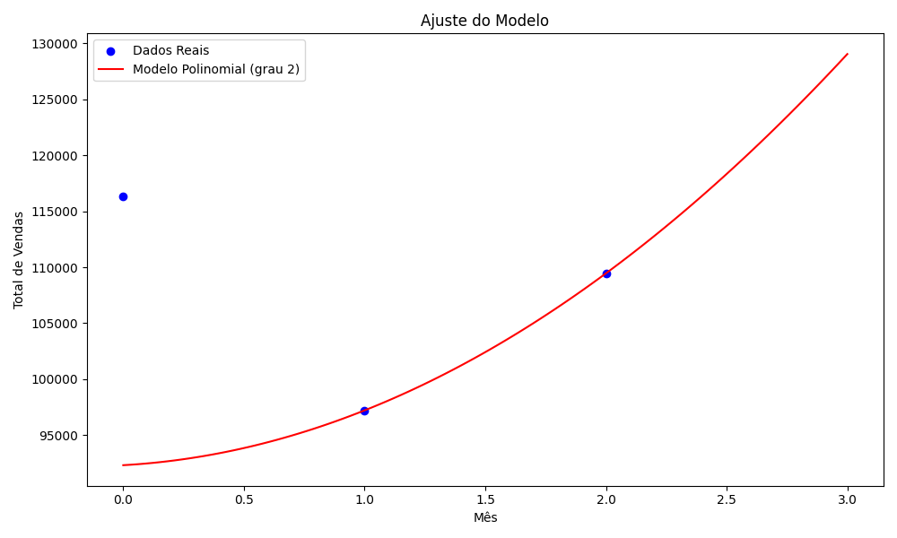

# 📈 Previsão de Vendas com Regressão Polinomial

Este projeto tem como objetivo analisar os dados de vendas de um supermercado e realizar previsões para os meses seguintes utilizando **Regressão Polinomial**.

---

## 🧠 Objetivo

Aplicar técnicas de regressão para prever o total de vendas futuras com base em dados históricos, realizando análises exploratórias, visualizações gráficas e avaliação de métricas.

---

## 🗃️ Dataset

O dataset utilizado foi o **Supermarket Sales** com dados fictícios de vendas.

- 📁 Local: `data/supermarket_sales.csv`
- Contém colunas como: `Invoice ID`, `Branch`, `City`, `Customer Type`, `Gender`, `Date`, `Product Line`, `Total`, entre outras.

---

## 🛠️ Funcionalidades

✔️ Carga e pré-processamento dos dados  
✔️ Análise de vendas por mês e por produto  
✔️ Criação de variável `Mes_Num` para facilitar a modelagem  
✔️ Treinamento de modelo de regressão polinomial (grau 2)  
✔️ Avaliação do modelo com **RMSE**  
✔️ Previsão de vendas para os próximos 3 meses  
✔️ Visualização gráfica do ajuste do modelo e das previsões

---

## 📊 Resultado Visual

---

## 📦 Tecnologias Utilizadas

- Python 3.10+
- Pandas
- Numpy
- Matplotlib
- Scikit-learn

---

